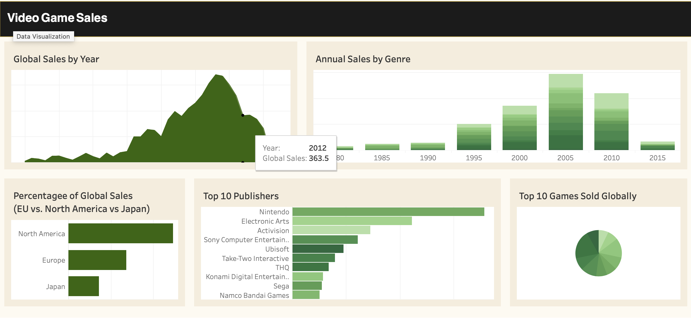

This interactive Tableau dashboard explores global video game sales data across several dimensions to uncover industry trends and insights. The visualizations provide a clear picture of sales performance over time, market distribution by region, and top contributors to global game sales.

**Key Insights Displayed:**

- **Global Sales by Year:** A line area chart highlights the rise and fall of video game sales over time, peaking in the mid-2000s.
- **Annual Sales by Genre:** A stacked bar chart compares genre-specific sales trends across decades.
- **Regional Sales Distribution:** A horizontal bar chart illustrates the percentage of total sales from North America, Europe, and Japan.
- **Top 10 Publishers:** A ranked bar chart displays leading publishers by global sales volume, with Nintendo topping the list.
- **Top 10 Games Sold Globally:** A pie chart visualizes the distribution among the highest-selling individual game titles.

This dashboard was designed to showcase storytelling with data and effective use of visual hierarchies in Tableau. It is a great example of combining multiple chart types into a cohesive analytical view for business intelligence.

🔗 [View Dashboard on Tableau Public](https://public.tableau.com/app/profile/ericnbello/viz/VideoGameSales_17394784637610/VideoGameSalesDashboard)